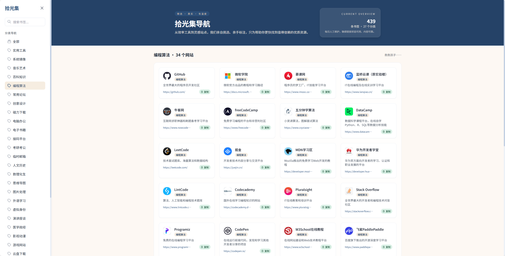
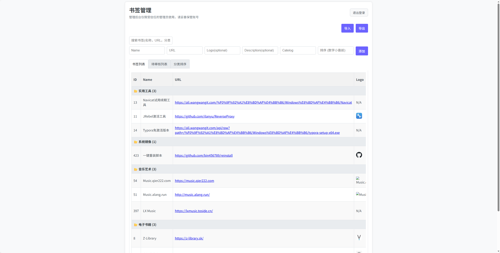

# 拾光集 - 精品网址导航站

<p align="center">
  
</p>

<p align="center">
  一个优雅、快速、易于部署的书签（网址）收藏与分享平台，完全基于 Cloudflare 全家桶构建。
</p>

<p align="center">
  <a href="https://nav.wangwangit.com">在线演示</a> •
  <a href="#快速开始">快速开始</a> •
  <a href="#配置项">配置</a> •
  <a href="#常见问题">FAQ</a> •
  <a href="#贡献指南">贡献</a>
</p>

<p align="center">
  
  
</p>

> 📁 旧版本（`worker.js`、`work_v1.js`、`work_v2.js`）已移至 [`old/`](./old/) 目录，相关文档见 [old/README.md](./old/README.md)。

---

## 预览

| 首页 | 后台管理 |
| :---: | :---: |
|  |  |

## 特性

- 📱 响应式设计，适配桌面、平板、手机
- 🔍 站内模糊搜索
- 📂 分类管理，支持自定义排序
- 🔒 HttpOnly 会话认证，12 小时有效期
- 📝 访客投稿（可关闭）
- ⚡ Cloudflare 边缘缓存，秒级加载
- 📤 数据导入/导出

## 技术栈

| 组件 | 技术 |
|------|------|
| 计算 | [Cloudflare Workers](https://workers.cloudflare.com/) |
| 数据库 | [Cloudflare D1](https://developers.cloudflare.com/d1/) |
| KV 存储 | [Cloudflare KV](https://developers.cloudflare.com/workers/runtime-apis/kv/) |
| 前端 | [TailwindCSS](https://tailwindcss.com/) |

## 项目结构

```
src/
├── index.js          # 入口，路由分发
├── api/              # API 路由（站点 CRUD、分类排序、待审核）
├── admin/            # 后台管理（认证、页面渲染）
├── frontend/         # 前台页面渲染
├── templates/        # HTML/CSS 模板
└── utils/            # 工具函数
```

## 前置条件

| 依赖 | 版本 | 说明 |
|------|------|------|
| [Cloudflare 账号](https://dash.cloudflare.com/sign-up) | — | 免费注册，需要 Workers、D1、KV 的访问权限 |
| [Node.js](https://nodejs.org) | 18+ | 运行时 |
| [Wrangler](https://developers.cloudflare.com/workers/wrangler/) | 3.0+ | Cloudflare CLI |

<details>
<summary><strong>Windows 用户注意</strong></summary>

1. 前往 https://nodejs.org 下载 LTS 版本，安装时勾选 "Add to PATH"。
2. 打开 PowerShell 运行 `node -v` 确认安装成功。
3. 若遇到 `npm : 无法加载文件...` 权限错误，以管理员身份运行：
   ```powershell
   Set-ExecutionPolicy RemoteSigned
   ```
</details>

## 快速开始

### 1. 安装 Wrangler 并登录

```bash
npm install -g wrangler
wrangler login
```

如果是无头环境（服务器/CI），使用 API Token：

```bash
# Cloudflare 控制台 → My Profile → API Tokens → Create Token
# 使用 "Edit Cloudflare Workers" 模板，确保包含 D1 和 KV 权限
export CLOUDFLARE_API_TOKEN="cfut_your_token_here"
```

### 2. 创建资源

```bash
# 创建 D1 数据库
wrangler d1 create book

# 初始化表结构
wrangler d1 execute book --remote --file=schema.sql

# 创建 KV 命名空间
wrangler kv namespace create NAV_AUTH
```

设置管理员账号：

```bash
wrangler kv key put --namespace-id=<你的KV_ID> admin_username "admin"
wrangler kv key put --namespace-id=<你的KV_ID> admin_password "你的密码"
```

### 3. 配置

复制 `wrangler.toml.example` 为 `wrangler.toml`，填入你的资源 ID：

```bash
cp wrangler.toml.example wrangler.toml
```

```toml
name = "nav"
account_id = "你的账户ID"
main = "src/index.js"
compatibility_date = "2024-01-01"

[[d1_databases]]
binding = "NAV_DB"
database_name = "book"
database_id = "你的D1数据库ID"

[[kv_namespaces]]
binding = "NAV_AUTH"
id = "你的KV命名空间ID"
```

### 4. 部署

```bash
wrangler deploy
```

### 5. 使用

1. 访问你的 Worker 域名。
2. 进入 `/admin`，用上面设置的账号密码登录。
3. 添加书签，首页即可展示。

## 本地开发

```bash
wrangler dev
# http://localhost:8787
```

## ⚠️ 数据库说明

### SQL 保留字

本项目使用 Cloudflare D1（SQLite 兼容）。建表时有以下注意事项：

| 列名 | 说明 | 注意事项 |
|------|------|----------|
| `desc` | 网站描述 | SQLite 保留字（`ORDER BY ... DESC`），当前 D1 可正常解析。若迁移至 MySQL/PostgreSQL，需加反引号：`` `desc` ``，或重命名为 `description` |
| `catelog` | 分类名称 | 项目自定义命名（非标准 `catalog`），已在代码中统一使用 |
| `sort_order` | 排序值 | `order` 是保留字，但 `sort_order` 不冲突 |

### 备份与恢复

```bash
# 导出数据库（全量）
wrangler d1 export book --output backup_$(date +%Y%m%d).sql

# 导入备份
wrangler d1 execute book --remote --file=backup_20260527.sql
```

## 配置项

| 配置 | 说明 | 默认值 |
|------|------|--------|
| `ENABLE_PUBLIC_SUBMISSION` | 是否允许访客投稿 | `true` |

关闭访客投稿：

```bash
wrangler secret put ENABLE_PUBLIC_SUBMISSION
# 输入: false
```

## 🔐 安全与运维

### 重置管理员密码

```bash
# 重新设置密码（替换 <KV_ID> 和 新密码）
wrangler kv key put --namespace-id=<KV_ID> admin_password "新密码"
```

### 会话机制

- 登录后颁发 **HttpOnly + Secure + SameSite=Strict** Cookie
- 会话有效期 **12 小时**，期间自动续期
- 退出登录立即销毁服务端会话
- 不支持 URL 参数传参登录（旧版方式已废弃）

### Cloudflare 账号要求

| 服务 | 免费额度 | 说明 |
|------|---------|------|
| Workers | 10 万次/天 | 本项目足够 |
| D1 | 5 GB 存储 + 500 万行读/天 | 书签数据 |
| KV | 10 万次/天 | 仅用于管理员认证 |

> 💡 个人使用基本不会超出免费额度。

## 常见问题

| 问题 | 解决方案 |
|------|---------|
| `wrangler: command not found` | `npm install -g wrangler` |
| Windows npm 权限错误 | 管理员 PowerShell: `Set-ExecutionPolicy RemoteSigned` |
| `Invalid API Token` | 确认 Token 以 `cfut_` 开头且权限包含 Workers/D1/KV |
| 部署后 502 | 检查 `wrangler.toml` 中的 `account_id`、`database_id`、`id` 是否正确 |
| 部署后白屏/空白 | 检查浏览器控制台是否有 JS 错误；确认 `compatibility_date` 设为当前日期 |
| 登录无反应 | 确保浏览器未禁用 Cookie（需支持 HttpOnly） |
| `no such table` | 执行 `wrangler d1 execute book --remote --file=schema.sql` |
| 忘记管理员密码 | 执行 `wrangler kv key put --namespace-id=<KV_ID> admin_password "新密码"` |
| 数据丢失如何恢复 | 使用 `wrangler d1 export` 导出备份，定期执行 |

## 贡献指南

1. Fork 本仓库
2. 创建分支 (`git checkout -b feature/xxx`)
3. 提交更改 (`git commit -m 'feat: add xxx'`)
4. 推送 (`git push origin feature/xxx`)
5. 发起 Pull Request

## 许可证

[MIT](LICENSE)

## 联系

- 作者: [@一只会飞的旺旺](https://github.com/wangwangit)
- 项目: [https://github.com/wangwangit/nav](https://github.com/wangwangit/nav)

[](https://dartnode.com "Powered by DartNode - Free VPS for Open Source")

---

<p align="center">如果觉得有用，请给个 ⭐️</p>
